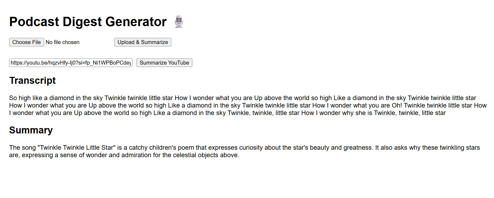

# Podcast Digest Generator

A full-stack application that allows users to upload podcast/audio files **or YouTube links**, transcribes the content using **Whisper**, and summarizes it using **Cohere AI**.

---

## Features

- Upload podcast (MP3) and get transcript + summary
- Paste a YouTube video link and receive a summary
- Frontend built with **React**
- Backend powered by **ASP.NET Core (.NET 8)**
- Audio transcription via **Whisper**
- Text summarization via **Cohere API**
- Audio download via **yt-dlp**

---

## Tech Stack

- **Frontend**: React, Axios
- **Backend**: ASP.NET Core Web API
- **AI**:
  - [OpenAI Whisper](https://github.com/openai/whisper)
  - [Cohere AI](https://cohere.ai/)
- **YouTube Download**: [yt-dlp](https://github.com/yt-dlp/yt-dlp)

---

## Project Structure
PodcastDigestGenerator/
├── PodcastDigest.API # ASP.NET Core Web API
├── PodcastDigest.Services # Whisper + Cohere logic
├── PodcastDigest.Data # (optional for storage)
├── PodcastDigest.Models # DTOs / Models
├── podcast-digest-ui/ # React frontend

---

## 📦 Getting Started

### Prerequisites

- [.NET 8 SDK](https://dotnet.microsoft.com/)
- [Node.js + npm](https://nodejs.org/)
- [Python](https://www.python.org/) (for Whisper + yt-dlp)
- `yt-dlp` installed (`pip install yt-dlp`)
- Whisper installed: `pip install openai-whisper`
- Cohere API key from [cohere.ai](https://cohere.ai/)

---

### Backend

cd PodcastDigestGenerator
dotnet run --project PodcastDigest.API

##Default API runs on: http://localhost:5129

###Frontend
cd podcast-digest-ui
npm install
npm start

##Frontend runs on: http://localhost:3000

###Environment Setup

In appsettings.json or through IConfiguration:
{
  "Cohere": {
    "ApiKey": "your-cohere-api-key"
  }
}

##Usage
-Upload an MP3 or drop a YouTube link.
-View the transcript and a clean summary.
-Suitable for content creators, listeners, and researchers.

##Screenshot
Here’s how the Podcast Digest Generator looks:

